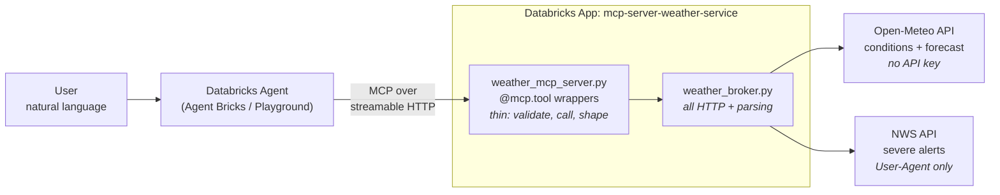

# Weather Prediction MCP Server + Agent

A [Model Context Protocol](https://modelcontextprotocol.io) server exposing weather
tools to a Databricks agent, deployed as a Databricks App.

**Live App URL:** <https://mcp-server-weather-service-7474646797973312.aws.databricksapps.com>
**MCP endpoint (register this):** `https://mcp-server-weather-service-7474646797973312.aws.databricksapps.com/mcp`

Opening the App URL in a browser shows a status page listing the live tools. Agents
talk to `/mcp`; `/health` is a liveness probe.

---

## Architecture



The split is deliberate and is what the tool layer's thinness buys: **no `requests`
call appears inside any `@mcp.tool` function.** Every HTTP call and every bit of
response parsing lives in `weather_broker.py`, so the weather logic can be tested
with a plain Python call — no MCP client, no agent, no deployed app.

---

## Tools

| Tool | Arguments | Returns |
|---|---|---|
| `get_current_weather` | `location` | temperature, feels-like, humidity, precipitation, wind, plain-language conditions |
| `get_forecast` | `location`, `days` (1–16, default 3) | per-day high/low, precipitation sum + probability, max wind, conditions |
| `should_i_bring_an_umbrella` | `location` | `yes`/`no`, confidence, a quotable reason, the thresholds applied, and the forecast figures judged |
| `get_severe_weather_alerts` | `location` | active NWS alerts with severity, urgency, headline, instruction, expiry (US only) |

`location` accepts a city (`"Chicago"`), city with region (`"Austin, Texas"`), or raw
coordinates (`"41.88,-87.63"`) as an escape hatch when the geocoder doesn't know a place.

### The prediction tool applies judgment, not passthrough

`should_i_bring_an_umbrella` reads today's forecast and applies explicit thresholds,
evaluated in this order:

| Condition | Verdict | Why |
|---|---|---|
| Gusts ≥ 35 km/h **and** rain likely | **no** | An umbrella inverts. Wind overrides rain — a broken umbrella is worse than none. Suggests a hooded waterproof. |
| Accumulation ≥ 10 mm | **yes** | Take one, but expect to get wet anyway; an umbrella alone isn't enough. |
| Probability ≥ 40% **or** accumulation ≥ 1.0 mm | **yes** | 40% is the usual "likely enough to plan around" convention; 1.0 mm is roughly where rain stops being a mist. |
| Otherwise | **no** | Below both thresholds. |

The thresholds are named constants, quoted verbatim in the tool's docstring and echoed
in every response under `thresholds_applied`, so the agent can *explain* a
recommendation rather than assert it.

---

## Weather APIs and auth method

| API | Used for | Auth |
|---|---|---|
| [Open-Meteo](https://open-meteo.com) | current conditions, forecasts, geocoding | **None.** No signup, no API key, ~10k calls/day. |
| [NWS](https://api.weather.gov) | severe-weather alerts | **None.** A descriptive `User-Agent` header only. |

**There are no secrets in this repo, because neither API needs a credential.** That was
the deciding factor in choosing Open-Meteo: no key means nothing to commit by accident,
nothing to rotate, and no service principal to grant access to.

If you swap in a keyed provider (e.g. WeatherAPI.com), **do not** hardcode the key or put
it in `app.yaml`. Store it as a Databricks secret and read it in `weather_broker.py`:

```python
import base64, os
from databricks.sdk import WorkspaceClient

_w = WorkspaceClient()
_SCOPE = os.environ.get("WEATHER_SECRET_SCOPE", "weather")

def _secret(key: str) -> str:
    """Fetch and base64-decode a value from the Databricks secret scope."""
    return base64.b64decode(_w.secrets.get_secret(scope=_SCOPE, key=key).value).decode()
```

Then put only the *scope and key names* in `app.yaml`, never the value.

---

## Error handling

Tools return a structured dict rather than raising, so the model gets something it can
act on instead of a stack trace:

```json
{
  "error": "unknown_location",
  "message": "Could not find a place called 'Xyzzyville'. Try a larger nearby city, or pass coordinates as 'lat,lon'.",
  "requested_location": "Xyzzyville",
  "suggestion": "Ask the user to confirm the city, or provide 'lat,lon'."
}
```

Two deliberate choices worth calling out:

- **Every response carries `resolved_location`.** If the geocoder matches Paris, Texas
  when the user meant Paris, France, that is visible in the answer instead of silently
  wrong.
- **A non-US location returns `coverage: "unavailable"`, not an error.** Empty alerts
  outside NWS coverage mean *no data*, not *no danger*, and the system prompt requires
  the agent to say so.

---

## Setup

### Run locally

```bash
git clone https://github.com/abhibastia/weather-mcp-agent.git
cd weather-mcp-agent
python -m venv .venv && .venv/bin/pip install -r mcp_server/requirements.txt

cd mcp_server && ../.venv/bin/python weather_mcp_server.py
# -> http://127.0.0.1:8000/mcp   (landing page at /)
```

Exercise a tool without an agent:

```bash
cd mcp_server
PYTHONPATH=. ../.venv/bin/python -c \
  "import weather_broker as w; print(w.get_current_conditions('Chicago'))"
```

### Deploy as a Databricks App

```bash
# 1. Upload the server (app.yaml must sit at the ROOT of the source path)
cd mcp_server
databricks sync . /Workspace/Users/<you>/weather-mcp-server --profile <profile> --full

# 2. The app must be RUNNING before it will accept a deployment
databricks apps start mcp-server-weather-service --profile <profile>

# 3. Deploy
databricks apps deploy mcp-server-weather-service \
  --source-code-path /Workspace/Users/<you>/weather-mcp-server --profile <profile>
```

> **Order matters.** `deploy` against a stopped app fails with *"not in RUNNING state"*.
> Start first, then deploy.

### Register as an external MCP and build the agent

1. Workspace → **AI Gateway** → **MCPs** → **Add MCP** / **Register external MCP**.
2. Paste the `/mcp` endpoint above as the server endpoint (streamable HTTP) and name it
   `weather-prediction`. Databricks introspects the server and lists the four tools.
3. Grant your agent access via Unity Catalog permissions if prompted.
4. Build the agent (**Agents → Agent Bricks → Create agent**, or the **AI Playground**),
   add the `weather-prediction` MCP server under **Tools**, and paste
   [`SYSTEM_PROMPT.md`](SYSTEM_PROMPT.md) as the system prompt.

---

## Layout

| Path | What it is |
|---|---|
| `mcp_server/weather_mcp_server.py` | FastMCP server — four `@mcp.tool` wrappers, landing page, `/health` |
| `mcp_server/weather_broker.py` | Adapter: all HTTP calls, geocoding, WMO code translation, parsing |
| `mcp_server/app.yaml` | Databricks App manifest (command, requirements resource, env) |
| `mcp_server/requirements.txt` | `fastmcp`, `requests`, `databricks-sdk` — nothing heavier |
| `SYSTEM_PROMPT.md` | The agent's system prompt |
| `RESULTS.txt` | Agent transcripts: questions, tool calls, answers |

---

## Notes and limitations

- **Alerts are US-only.** Inherent to NWS. Non-US locations report
  `coverage: "unavailable"` rather than an empty-but-reassuring alert list.
- **Geocoding matches on the city name.** `"Austin, Texas"` searches for `Austin`; the
  region hint is not sent upstream. `resolved_location` exposes what actually matched.
- **Forecast horizon is capped at 16 days** by Open-Meteo. Larger values are clamped
  rather than rejected, so the agent gets a usable answer instead of an error.
- **No caching.** Every tool call hits the upstream API. Fine at demo volume and well
  inside Open-Meteo's limits; a short TTL cache would be the first optimisation.
- **No automated tests.** Behaviour was verified by calling every tool through a real
  MCP client against the deployed app, and by exercising all four decision branches of
  the prediction tool with synthetic forecasts.
